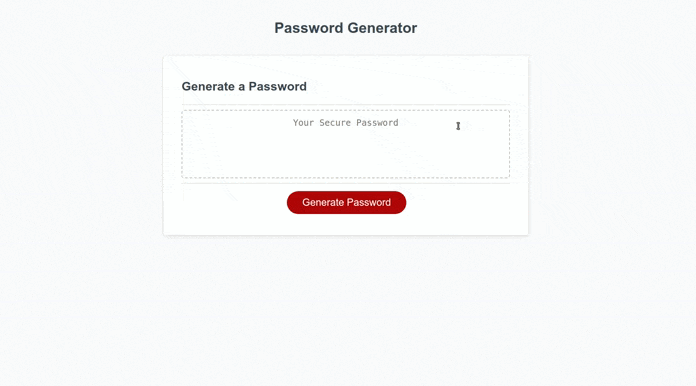

# Password Generator

## Description

Provide a short description explaining the what, why, and how of your project. Use the following questions as a guide:
I wanted to create a JavaScript-powered password generator. I wanted the password generator to ask the user for criteria (such as how long the password should be and what types of characters should be used). It solves the problem of having to make convoluted passwords for webpages and prevents the possibility of reusing the same password. I learned while working on this was how to interact with arrays, how to maniuplate arrays, and how to work with math methods to create random numbers.

## Usage

